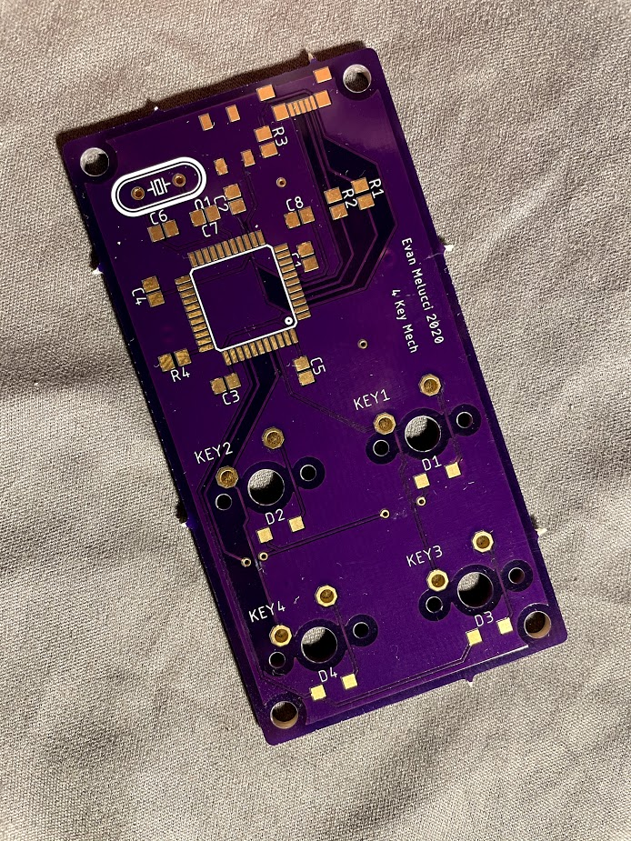

# 4-Key-Keyboard-PCB

This project is not yet complete.

With Autodesk EAGLE, I designed and routed a PCB for a 4 key keyboard.  I accomplished this through implementing some library components and creating some of my own component footprints and schematics for existing components with manufacturer documentation.  After hand routing the board, I ordered a few copies from a manufacturer.  These can be seen below.  
The next steps in this project are to solder the components onto a board, program the ATmega32U4, and test.  

